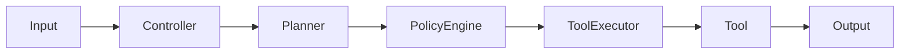

# SentinelAI — Architecture

SentinelAI follows Clean Architecture and SOLID principles, ensuring strong separation of concerns, testability, and future extensibility.

## Core Architectural Patterns

### 1. Layered Pipeline Architecture

The system operates as a uni-directional execution pipeline:

Data flows strictly in one direction. Each component is completely unaware of the components before or after it in the pipeline, coupled only through well-defined data models (`Plan`, `PolicyDecision`, `ExecutionResult`).

### 2. Dependency Injection (DI)

Dependencies are injected via constructors. Global state is avoided.

- `AssistantController` requires `PlannerStrategy` and `ToolExecutor`.
- `ToolExecutor` requires a `dict[str, Tool]` (the registry).
- `LLMPlanner` requires an `LLMClient`.
- `PathValidator` requires a `list[AllowedRoot]` and blocked patterns.

The application composition root is `app/launcher/main.py`. This is the only place where concrete implementations are wired together.

### 3. Strategy Pattern

The `PlannerStrategy` (in `app/planner/strategy.py`) defines the interface for creating a `Plan`.
Currently, there are two implementations:
- `RulePlanner`: Regex-based matching (active).
- `LLMPlanner`: Placeholder for future LLM integration.

The `AssistantController` depends on the interface, not the concrete implementation.

### 4. Zero Trust Security Model

Components do not trust each other.
- The `PolicyEngine` evaluates the `Plan` based on intent and risk, regardless of who created the `Plan` (RulePlanner or future LLMPlanner).
- The `Tool` implementations do not trust the `Plan.parameters`. For example, the `ApplicationTool` validates the app name against an `ApplicationAllowlist`. The `FilesystemTool` (via `PathValidator`) validates paths against allowed roots and blocked directories before any OS operation.

### 5. Data Transfer Objects (DTOs)

Communication between components happens via immutable (or logically immutable) dataclasses and simple dictionaries:
- `app/models/plan.py`: `Plan(intent: str, tool: str, parameters: dict)`
- `app/policy/decision.py`: `PolicyDecision(is_allowed: bool, reason: str, requires_confirmation: bool)`
- `app/tools/result.py`: `ExecutionResult(success: bool, message: str, data: dict | None)`

## Component Breakdown

1. **Controller (`app.controller`)**: The orchestrator. It receives user input, passes it to the planner, passes the plan to the policy engine, and passes the allowed plan to the tool executor. It contains *zero* business or execution logic.
2. **Planner (`app.planner`)**: Translates natural language into a structured `Plan`.
3. **Policy Engine (`app.policy`)**: Evaluates the `Plan` against predefined rules. Returns a `PolicyDecision`.
4. **Tool Framework (`app.tools`)**: Executes the `Plan`. `ToolExecutor` routes the plan to the specific `Tool`.
5. **LLM (`app.llm`)**: Houses the HTTP client for communicating with Ollama.
6. **Launcher (`app.launcher`)**: The composition root (`main.py`).

## SOLID Principles in Practice

- **Single Responsibility Principle**: `PathValidator` only validates paths; it doesn't read files. `PolicyEngine` only decides if an action is allowed; it doesn't execute it.
- **Open/Closed Principle**: New tools can be added by implementing the `Tool` ABC and adding them to the registry without modifying `ToolExecutor`.
- **Liskov Substitution Principle**: `ToolExecutor` can iterate over any class inheriting from `Tool` and call `.execute(plan)`.
- **Interface Segregation Principle**: Tool interfaces are kept simple (`execute(plan: Plan) -> ExecutionResult`).
- **Dependency Inversion Principle**: The controller depends on `PlannerStrategy`, not `RulePlanner`.
