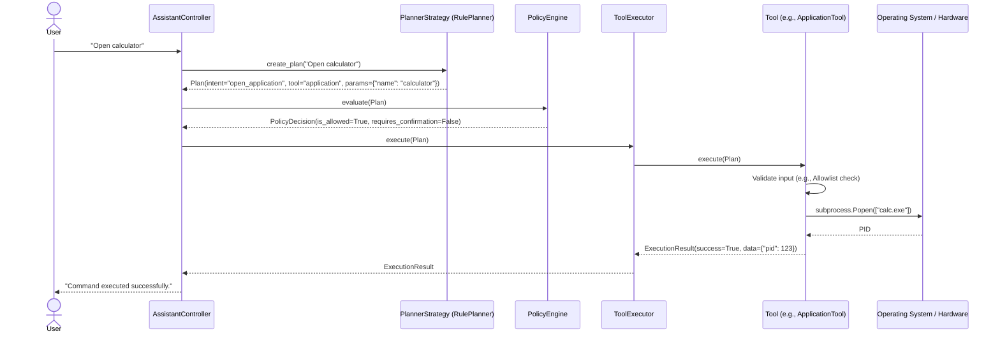

# SentinelAI — Execution Pipeline

The core of SentinelAI is its strict execution pipeline. Every request follows the exact same path.

## The Pipeline

## Step-by-Step Breakdown

### 1. User Input
The user provides input via the CLI (in `main.py`). The input is passed to the `AssistantController.process_message()` method.

### 2. Planning (`PlannerStrategy`)
The Controller delegates to the injected Planner. Currently, this is the `RulePlanner`.
- The input is checked against regex patterns in the `CommandRegistry`.
- If a match is found, a structured `Plan` object is returned.
- If no match is found, the planner defaults to a `chat` intent targeting the `llm` tool.
- *Crucially, the Planner does not execute anything. It only expresses intent.*

### 3. Policy Evaluation (`PolicyEngine`)
The Controller passes the generated `Plan` to the `PolicyEngine`.
- The engine checks the `intent` against `POLICY_RULES` in `app/policy/rules.py`.
- It maps the intent to a `RiskLevel` (LOW, MEDIUM, HIGH, CRITICAL).
- It returns a `PolicyDecision`.
- If `is_allowed` is False (e.g., CRITICAL risk, or unknown intent), the Controller aborts execution and notifies the user.
- If `requires_confirmation` is True (e.g., HIGH risk like deleting files), the Controller prompts the user (Y/n) before proceeding.

### 4. Tool Dispatch (`ToolExecutor`)
If the PolicyEngine allows the action, the Controller passes the `Plan` to the `ToolExecutor`.
- The Executor looks up the `tool` name (e.g., `"application"`) in its injected registry dictionary.
- If the tool is not found, an error `ExecutionResult` is returned.
- If found, the Executor calls `Tool.execute(plan)`.

### 5. Tool Execution & Validation (`Tool`)
The selected `Tool` receives the `Plan`.
- **Zero Trust:** The Tool does *not* trust the Plan's parameters.
- It performs its own validation (e.g., `ApplicationTool` checks the `ApplicationAllowlist`, `FilesystemTool` uses the `PathValidator`).
- If validation passes, the Tool performs the actual OS operation.
- The Tool catches specific OS exceptions (e.g., `FileNotFoundError`, `PermissionError`) and converts them into structured `ExecutionResult` objects.

### 6. Result Return
The `ExecutionResult` flows back up the chain: Tool -> Executor -> Controller. The Controller then formats a response for the user.
