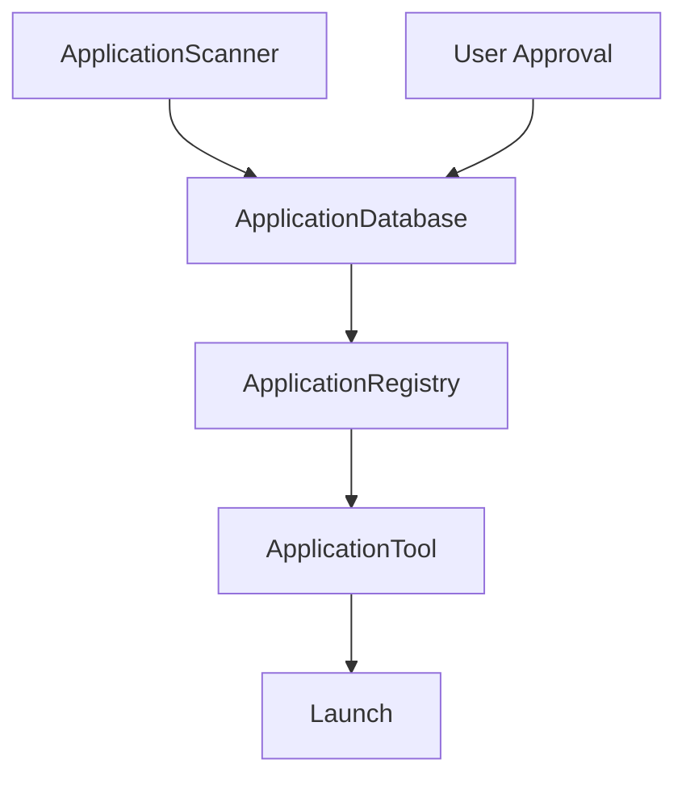

# Application Registry

## Purpose

SentinelAI uses a dynamic Application Registry to separate **discovery** from **trust**.

Discovery answers: *What applications are installed on this machine?*
Trust answers: *Which of those applications is SentinelAI allowed to launch?*

Discovery never implies approval. Every discovered application is stored with `approved = false` until a user or future GUI explicitly marks it as trusted.

## Zero Trust Model

The registry preserves SentinelAI's zero trust boundary:

- The scanner may discover applications.
- The database may persist applications.
- The registry may expose only approved applications.
- The application tool may launch only approved applications.

No discovered application is executable by default.

## Components

### ApplicationScanner

Responsible only for discovery.

It searches common Windows locations such as:

- Start Menu programs
- PATH entries
- Program Files
- Program Files (x86)
- Desktop shortcuts where available
- Registry-backed install metadata where available

It produces immutable application models and always marks them as unapproved.

### ApplicationDatabase

Responsible only for persistence.

It stores application records in JSON and supports:

- `load()`
- `save()`
- `add()`
- `update()`
- `remove()`
- `mark_approved()`
- `mark_unapproved()`

It does not scan the machine and it does not launch applications.

### ApplicationRegistry

Responsible only for trusted lookup.

It loads the database and exposes only `approved == true` applications.

It supports:

- `lookup(name)`
- `all()`
- `refresh()`

It never scans the machine and never launches applications.

### ApplicationResolver

Responsible only for mapping user input to a trusted application.

It supports:

- case-insensitive matching
- aliases
- fuzzy matching where reasonable

Examples:

- `chrome` → `Google Chrome`
- `vs code` → `Visual Studio Code`
- `gitub/prem043m` style browser requests remain in the planner and are not handled here

### ApplicationTool

Responsible only for launching trusted applications.

It asks the registry for a trusted application and launches the resolved executable path. If the application is not approved or not present in the registry, it is refused.

## Data Flow

1. The scanner discovers installed applications.
2. The database persists discovered records with `approved = false`.
3. The user approves selected applications.
4. The registry loads the database and returns only approved records.
5. The application tool resolves a user request through the registry and launches only approved applications.

## Approval Workflow

A future GUI can render the registry as a checklist:

- `☑ Calculator`
- `☑ Google Chrome`
- `☐ Steam`
- `☐ Discord`
- `☐ Docker Desktop`

The GUI should only toggle the `approved` flag. No architecture changes should be required.

## Why Discovery Is Not Trust

Installed software is not automatically safe just because it exists on the machine.

Examples:

- Developer tools may be installed but not intended for automated launch.
- Games and optional utilities should not be trusted without approval.
- New software added by another user account should still require explicit approval.

This design keeps SentinelAI safe even when discovery is broad.

## Future Integration Points

- **GUI**: approval management and search UI over registry records.
- **Memory**: long-lived preferences may eventually influence approval recommendations, but memory must never override the trust boundary.
- **Code Intelligence**: future analysis tools may suggest application names or aliases, but they must not auto-approve anything.

The architecture is intentionally split so discovery, persistence, trust, and launch remain independently testable.